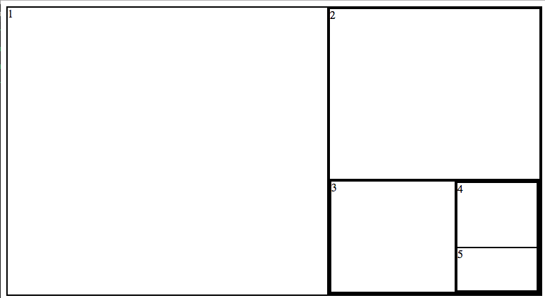

Fibonacci partition web layout
==============================

The task is to create a web layout that looks like a simplified version of
the Fibonacci spiral.

Simplifications:
 - The ratios in which the space are divided can be approximated to 60-40.
 - The division of bigger/smaller rectangles does not have to follow a clockwise
   pattern, it can be always top-left is bigger, bottom-right is smaller.

Sample image:

Requested interface:
 - Provide a JS file that exports a function "fib" that:
   - Takes an array of `HTMLElement` (the elements to be laid out).
   - returns a new `HTMLElement` that can be appended to the document.
 - Provide the necessary styles in a CSS file.
 - Provide a sample html file that ties everything together and showcases how
 it works.
